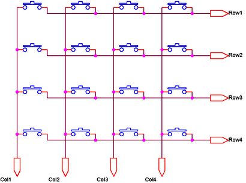

# HW04: CẤU HÌNH VÀ GIAO TIẾP NGOẠI VI GPIO TRÊN STM32F103

## 1. MIÊU TẢ BÀI TOÁN

Ngoại vi GPIO (General Purpose Input/Output) là cửa ngõ cơ bản nhất để vi điều khiển tương tác với thế giới vật lý bên ngoài. Để làm chủ ngoại vi này, một kỹ sư nhúng không chỉ đơn thuần là gọi các hàm thư viện có sẵn, mà cần phải hiểu rõ kiến trúc phần cứng bên trong (như cấu trúc Transistor PMOS/NMOS, mạch Pull-up/Pull-down), quy trình 3 bước cấu hình hệ thống (Clock -> Hardware -> Application Logic) và cách tối ưu hóa tài nguyên phần cứng qua các thuật toán quét ma trận.

Bài tập này yêu cầu học viên vận dụng kiến thức từ buổi học để giải quyết các bài toán cấu hình GPIO cơ bản và hoàn thiện thuật toán quét mã trận phím $4\times4$ (Keypad) ứng dụng trên phần cứng mạch thật STM32 Blue Pill.

---

## 2. CHUẨN BỊ MÔI TRƯỜNG & THƯ VIỆN HAL

Để hoàn thành phần thực hành, học viên cần tải và cấu hình đầy đủ gói thư viện chuẩn từ nhà sản xuất STMicroelectronics. Thư viện này cung cấp các Driver phần cứng lớp HAL (Hardware Abstraction Layer) cần thiết cho dự án.

- **Tải gói thư viện STM32F1 Cube**: Học viên tải trực tiếp kho mã nguồn và thư viện chính thức tại [GitHub STMicroelectronics - STM32CubeF1](https://github.com/STMicroelectronics/STM32CubeF1).
- **Thư mục cần lưu ý**: Sau khi giải nén, các file driver điều khiển GPIO nằm trong thư mục `Drivers/STM32F1xx_HAL_Driver/`. Học viên cần chú ý hai file cốt lõi là `stm32f1xx_hal_gpio.c` và `stm32f1xx_hal_gpio.h` để tích hợp vào project biên dịch qua CMake.

---

## 3. YÊU CẦU

Học viên phải hoàn thành **3 câu hỏi tự luận mở** cùng **3 nhiệm vụ thực hành mạch thật**.

### PHẦN 1: CÂU HỎI TỰ LUẬN MỞ (Ghi câu trả lời vào file `answers.txt`)

#### **Task 1 (Kiến trúc Phần cứng): Bản chất các chế độ GPIO**
- **Câu hỏi 1**: Trong cấu trúc bên trong của một chân GPIO Output (Push-Pull), cặp Transistor PMOS và NMOS phối hợp đóng/ngắt như thế nào khi cấu hình chân ở mức logic `1` (3.3V) và mức logic `0` (0V)? 
- **Câu hỏi 2**: Khi nào ta cần cấu hình một chân GPIO ở chế độ **Input Pull-up**? Nếu một chân cấu hình là Input nhưng lại để ở trạng thái **Floating (No Pull-up/Pull-down)** và không kết nối vào đâu, hiện tượng gì sẽ xảy ra với giá trị đọc được của thanh ghi dữ liệu đầu vào?

#### **Task 2 (Quy trình Cấu hình ngoại vi): Tầm quan trọng của Xung nhịp (Clock)**
- **Câu hỏi 3**: Theo quy trình 3 bước cấu hình ngoại vi nhúng, bước đầu tiên luôn luôn là **Cấp nguồn xung nhịp (Enable Peripheral Clock)** thông qua hệ thống bus (APB/AHB). Tại sao nhà sản xuất chip (ST) lại mặc định tắt toàn bộ Clock của ngoại vi khi vừa reset chip? Chuyện gì sẽ xảy ra nếu bạn cấu hình các thanh ghi chức năng của GPIO mà quên bật Clock cho Port đó?

---

### PHẦN 2: THỰC HÀNH TRÊN MẠCH THẬT

#### **Task 3 (Output): Điều khiển Led Blink và linh hoạt cấu hình**
- **Yêu cầu**: Cấu hình một chân GPIO bất kỳ (ví dụ `PC13`) làm **Digital Output Push-Pull**. Viết chương trình điều khiển một đèn LED nhấp nháy với chu kỳ 1 giây (500ms Sáng, 500ms Tắt). 
- *Ràng buộc kỹ thuật*: Mã nguồn phải tuân thủ việc bật APB2 Clock trước khi cấu hình thanh ghi chế độ.

#### **Task 4 (Output & Input): Giao tiếp nút nhấn chống dội chống giữ (Debounce)**
- **Yêu cầu**: Kết nối thêm một nút nhấn vật lý vào một chân GPIO (cấu hình **Input Pull-up**). Viết chương trình điều khiển: Cứ mỗi lần người dùng **nhấn và thả** nút ra (chỉ tính 1 lần nhấn duy nhất, nhấn giữ không được đảo trạng thái liên tục), trạng thái của đèn LED ở Task 3 sẽ được đảo (Sáng thành Tắt, Tắt thành Sáng).
- *Ràng buộc kỹ thuật*: Phải có giải thuật phần mềm để chống dội phím (Debounce) nhằm tránh hiện tượng LED bị loạn trạng thái do nhiễu cơ khí của nút nhấn.

#### **Task 5 (Matrix Keypad): Quét ma trận phím $2\times2$**
Hệ thống cần mở rộng giao tiếp với Ma trận bàn phím $2\times2$ gồm 2 hàng và 2 cột.
- **Yêu cầu**: 
  1. Cấu hình 2 chân Hàng làm **Digital Output** và 2 chân Cột làm **Digital Input Pull-up**.
  2. Triển khai thuật toán quét ma trận tại hàm `while(1)`: Lần lượt kéo từng hàng xuống mức `0`, sau đó đọc trạng thái của 2 cột để xác định chính xác phím nào đang được nhấn.
  3. Yêu cầu tích hợp LED phản hồi (Học viên tự chọn 1 trong 2 cách đấu nối phần cứng sau):
	- **Cách 1 (Mạch điện tử thuần)**: Đấu nối led đơn trực tiếp với nút bấm thuộc ma trận phím (sử dụng thêm điện trở hạn dòng thích 	hợp). Khi phím được nhấn, mạch kín dòng điện làm LED sáng vật lý, đồng thời vi điều khiển đọc được logic phím.
	- **Cách 2 (Điều khiển qua Firmware)**: Đấu nối LED đơn vào một chân GPIO trống bất kỳ trên board và cấu hình chân này làm Digital 	Output. Khi thuật toán quét ma trận phía trên phát hiện phím mục tiêu được nhấn, phần mềm sẽ ra lệnh xuất mức logic tương ứng để 	bật/tắt LED này.
  4. Quay 1 video ngắn (dưới 30 giây) demo cho sản phẩm phần cứng sau khi hoàn thành và đăng tải lên **Youtube** hoặc **Google Drive** (không bắt buộc Public hay Private).
  **Học viên có thể tham khảo giải thuật sau đây:**


---

## 4. RÀNG BUỘC KỸ THUẬT VÀ NỘP BÀI

  1. Tất cả câu trả lời tự luận của **Task 1, Task 2** và link demo video của **Task 5** phải được ghi chung vào file văn bản thuần có tên là `answers.txt`.
  2. Toàn bộ mã nguồn thực hành của **Task 3, 4, 5** phải được hoàn thiện, sử dụng thư viện HAL và đăng nộp toàn bộ Workspace.
  * *Lưu ý*: Học viên phải nói rõ trong video hoặc ghi chú ở dòng đầu tiên của file `answers.txt` về việc mình đang chọn thiết kế LED phản hồi cho **Task 5** theo **Cách 1** hay **Cách 2**.
---

## 4. KẾT QUẢ HIỂN THỊ MỤC TIÊU (LOG TERMINAL)

Nếu học viên cấu hình thêm UART để debug kết quả quét phím (Khuyến khích, không bắt buộc), log trả về khi nhấn các phím sẽ tuần tự có dạng:

```text
[GPIO Init] Clock enabled for GPIOA and GPIOC.
[GPIO Init] Matrix Keypad 4x4 Configured successfully.
[Keypad Scan] Key '1' Pressed -> Turn ON LED!
[Keypad Scan] Key '2' Pressed -> Turn OFF LED!
[Keypad Scan] Key 'A' Pressed -> No action assigned.